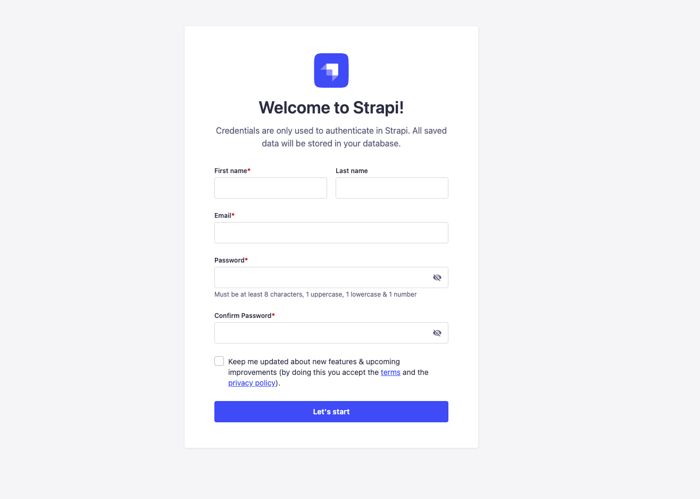
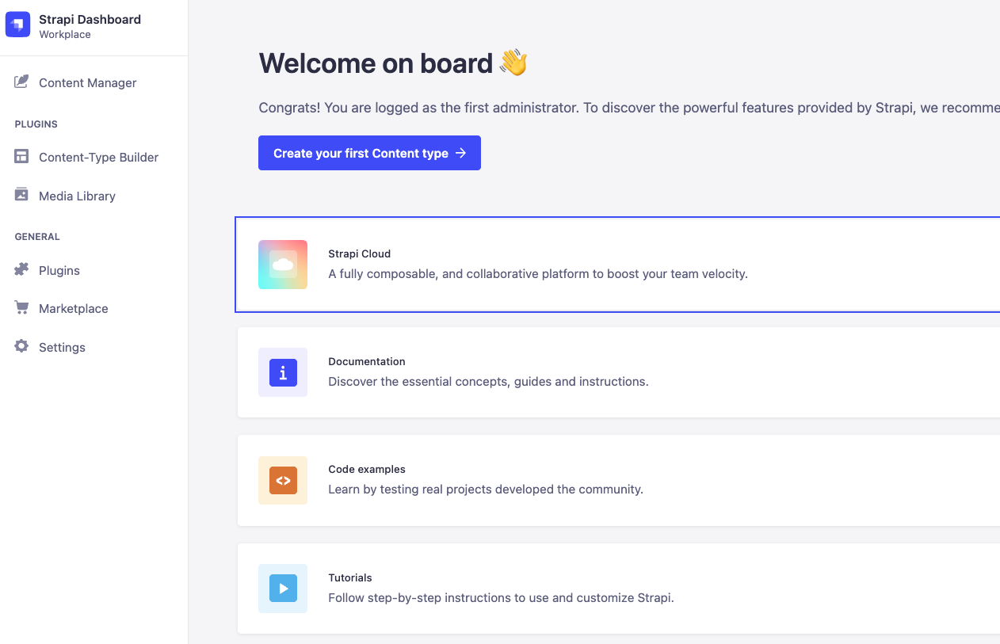
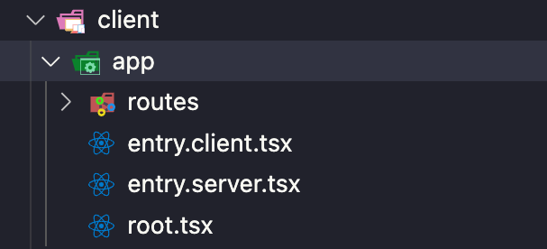

# GETTING STARTED WITH REMIX, TAILWIND, TYPESCRIPT AND STRAPI

## Prerequisets

- node
- javascript
- react

## What are we building

We are going to create this basic landing page that wil have all of its content dynamically managed by our backend.


Lessons learned from this tutorial will get you famililar with Remix and Strapi and allow you to continue to building out this website on your own.

In the future we will add other pages and a blog section, but in this tutorial we will just focus on the landing page, as well as, hook up the form to actually allow users sing up.


## Setting Up The Frontend (Remix)

Let's get started by setting up our Remix Frontend

You can learn more about Remix [here](https://remix.run/).

To create our Remix frontend we can run the following command:

```bash
  npx create-remix@latest
```

1. You will be asked where would you like to create your app, I will created in my root folder and call it **client**.

```bash
  ? Where would you like to create your app? client
```

2. Select just the basics to get started quickly.

```bash
  ? What type of app do you want to create? (Use arrow keys)
❯ Just the basics
  A pre-configured stack ready for production
```

3. Next let's choose where we would like to deploy our application. I am going to select Netlify.

```bash
   ? Where do you want to deploy? Choose Remix App Server if you're unsure; it's
   easy to change deployment targets.
     Remix App Server
     Express Server
     Architect (AWS Lambda)
     Fly.io
   ❯ Netlify
     Vercel
     Cloudflare Pages
   (Move up and down to reveal more choices)
```

4. Yes, we will use Typescript, don't worry we will only use the basics.

```bash
   ? TypeScript or JavaScript? (Use arrow keys)
   ❯ TypeScript
     JavaScript
```

5. And finally select `Y` to run `npm install`.

```bash
  ? Do you want me to run `npm install`? (Y)
```

This will go ahead and set up our Remix application locally.

We will come back and explore the folder structure in a bit and yet Tailwind, but first I want to show you how easy it is to get started with Strapi.

## Setting Up The Backend

Now let's set up Strapi.  Strapi allows you to set up a backend API ni less than 2 minutes.

You can learn more about Strapi [here](https://strapi.io/).

To create our Strapi backend we can run the following command:

```bash
  npx create-strapi-app@latest server --quickstart
```
`--quickstart` flag will allow us to get started quickly with the basics.  It will set up SQLite Database that is perfect for development. 

Once the installation is complete you will be greeted by the Strapi welcome scree.  Go ahead and create your first admin user.



Once you done creating your admin user, you will be greeted by the dashboard. 



And we are done, we not have our API backend set up.

Told you, two minutes.

## Let's Explore Remix Frontend Code and Setup Tailwind.

There is a lot to talk about here, but we will just focus on the basics and learn things as needed.  

Let's take a look at our `app` folder and the `root.tsx` file and then explore our `routes` folder.


